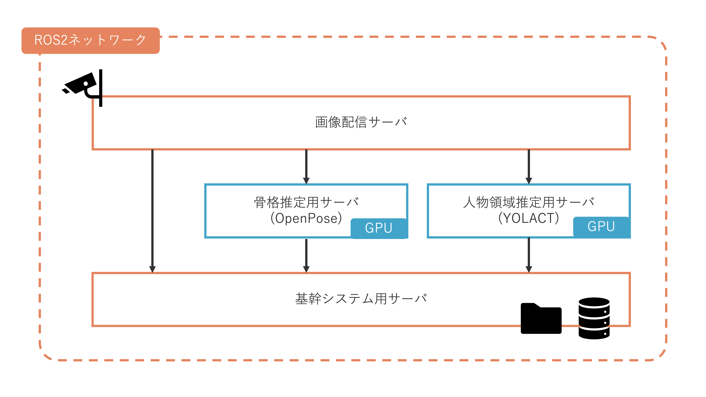

# 環境
ここではShigureを取り巻く環境について説明します。

## 通信環境
ShigureはROS2という通信フレームワーク上で通信を行います。
ROS2については[公式ドキュメント](https://docs.ros.org/en/foxy/index.html)を参照してください。

## ハードウェア観点の構成

現在、Shigureは4台のサーバで稼働しています。
この4つのサーバがROS2ネットワーク上で協調し、イベント検知を行っています。

### 画像配信サーバ
カメラが接続されているサーバです。
カメラから映像と深度情報を取得し、ROS2ネットワーク上に公開します。
現在の構成ではRealSenseというカメラが用いられています。

カメラは以下の要件を満たす必要があります。
* カラー画像が撮影できる
* 深度情報を取得できる

### 基幹システム用サーバ
Shigureのメイン処理を行うためのサーバです。
画像配信サーバや各推定サーバからの画像やデータをもとにイベント検知を行います。

また、検知したイベントデータを保存します。
画像はファイルストレージにメタデータはDBに保存されます。

### 骨格推定用サーバ
人物の骨格を検出するためのサーバです。
OpenPoseという深層学習モデルを用いているため、OpenPoseを実行できるGPUが必要となります。

### 人物領域推定用サーバ
人物の領域を検出するためのサーバです。
YOLACTという深層学習モデルを用いているため、YOLACTを実行できるGPUが必要となります。