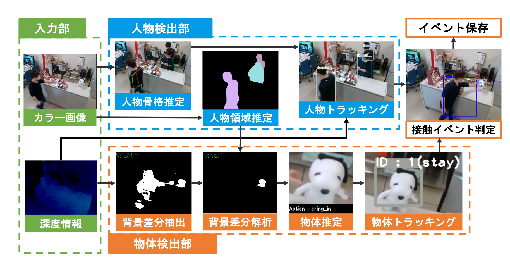

# 概要
ここではShigureの概要を説明します。

## Shigureとは

Shigure（読み：しぐれ）は室内イベント検知システムの開発コードネームです。
室内イベント検知システムはカメラの色情報や深度情報をもとに、監視している範囲のイベントを検知し記録します。

名前の由来は作った人が艦これというゲームが好きで、そのゲームのキャラクターから命名しました。

## \[参考\] Shigureが作られた経緯
Shigureが作られる以前にも室内イベント検知システムは研究室に存在していました。
しかし、以下のような課題がありました。
* コードが適切に管理されていない（誰が持っているコードで想定通りの挙動をするかわからない状態）
* コードが難解であり、改修が困難
    * コードが密結合
* Windowsでしか動作しない
* 利用できるカメラはもう新規に購入できない（Kinect）

これらの課題を解決するためにShigureは作られました。
