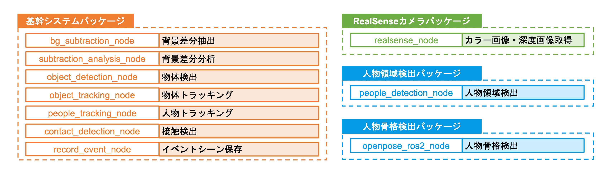

# システム構成
ここではShigureのシステム構成について説明します。

## Shigureの特徴

Shigureは「階層型イベント検知」という手法を採用しています。
この手法はカラー画像情報や深度情報を下位レベルの情報、隠す・飲むといった具体的なイベント情報を上位レベルの情報として扱い階層的に処理をしています。

ShigureはROS2ネットワーク上で通信を行っています。
各階層の処理をNodeとして定義し、処理した結果をTopicとして配信しています。
詳細については「ShigureのROS上での通信」の項を参照してください。

## Shigureの構成
Shigureは大きく4つの構成に分けられます。
* Shigure Core
* Shigure Plugin
* Shigure Input
* Shigure Visualizer

### Shigure Core
* Shigureのドメインロジック（メイン処理）が実装されています。
* 各階層の処理をNodeとして定義、実装しています。
* Shigureのみで使われることを想定しており、他のプロジェクトで動作することを想定していません。
* マシンパワーが必要な処理をするNodeはShigure Pluginとして定義しています。
    * 処理に深層学習モデルを利用する場合。
    * Shigure CoreがShigure Pluginを利用する形になります。
    * ロジックやROSパッケージを明示的に分けることでハードウェアを分けられたり再利用性を高めたりする効果が期待できます。
* 複数のNodeで構成されていますが、ROSパッケージは1つです。

#### リポジトリ
* [Shigure Core](https://github.com/Rits-Interaction-Laboratory/shigure_core)

### Shigure Plugin
* 処理に深層学習モデルを利用する等、マシンパワーが必要な処理をするNodeを定義しています。
* Shigure以外でも利用されることを想定しています。
* 基本的にNodeは1つだけ定義されています。
* ROSパッケージは役割ごとに1つずつ分けられています。

#### リポジトリ
* [People Detection ROS2（人物領域抽出）](https://github.com/Rits-Interaction-Laboratory/people_detection_ros2)
* [OpenPose ROS2（人物骨格抽出）](https://github.com/Rits-Interaction-Laboratory/openpose_ros2)

### Shigure Input
* イベント検知に必要なカラー画像・深度情報を公開するNodeを定義しています。
* Shigure以外でも利用されることを想定しています。
* rosbagを利用することもできます。

#### リポジトリ
* [RS ROS2 Python（RealSense）](https://github.com/Rits-Interaction-Laboratory/rs_ros2_python)

### Shigure Visualizer
* Shigureのデータを取得するAPIやそれをUIとして表示する機能群のことを指します。
* 厳密にはShigureの中には含まれません。
    * Shigureと直接通信することはなく、あくまでShigureのデータを利用する関連コンポーネントです。
* 通信はROS上だけではなく、場合によってはHTTPを採用することもあります。

### \[参考\] 論文上のノード構成との対応

本ドキュメントは開発のために書かれているため、論文上の表記と異なる場合があります。
以下に対応を記します。

| Node名                    | 処理概要               | 本ドキュメントの構成種別 | 論文上の構成種別 |
| ----                      | ----                  | ----                 | ----          |
| bg_subtraction_node       | 背景差分抽出            | Shigure Core         | 物体検出部      |
| subtraction_analysis_node | 背景差分分析            | Shigure Core         | 物体検出部      |
| object_detection_node     | 物体検出               | Shigure Core         | 物体検出部      |
| object_tracking_node      | 物体トラッキング        | Shigure Core         | 物体検出部      |
| people_tracking_node      | 人物トラッキング        | Shigure Core         | 人物検出部      |
| contact_detection_node    | 接触検出               | Shigure Core         | -             |
| record_event_node         | イベントシーン保存       | Shigure Core         | -             |
| people_detection_node     | 人物領域検出            | Shigure Plugin       | 人物検出部      |
| openpose_ros2_node        | 人物骨格検出            | Shigure Plugin       | 人物検出部      |
| realsense_node            | カラー画像 / 深度情報取得 | Shigure Input        | 入力部         |

#### リポジトリ
* [HoloLens Viewer](https://github.com/Rits-Interaction-Laboratory/shigure_hololens_viewer)

## ROSパッケージ構成

Shigureは画像のようなROSパッケージ構成となっています。

### 基幹システムパッケージ
前節のShigure Coreにあたるパッケージです。
現運用(ref: [環境](./environment.md))は1台のサーバで動作していますが、複数のサーバに分散させて動作させることも可能です。

### RealSenseカメラパッケージ
前節のShigure Inputにあたるパッケージです。

### 人物領域検出パッケージ
前節のShigure Pluginにあたるパッケージです。
動作にはGPUを搭載したサーバが必要です(ref: [環境](./environment.md))。

### 人物骨格検出パッケージ
前節のShigure Pluginにあたるパッケージです。
動作にはGPUを搭載したサーバが必要です(ref: [環境](./environment.md))。
